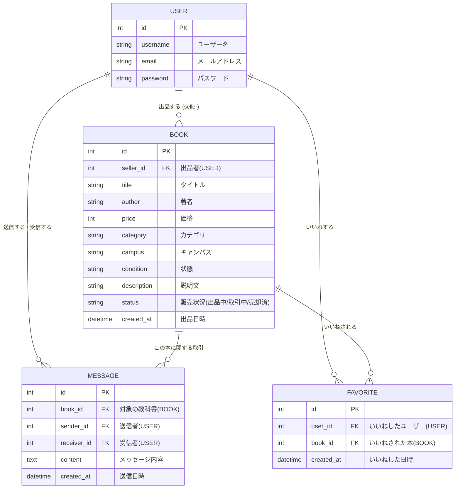

# データベース（DB）設計

教科書売買アプリ（Trading Text）のデータベース設計です。

## ER図

## テーブル詳細

### 1. `User` テーブル（Django標準 `auth.User`）
ユーザー情報を管理する。Djangoの標準機能を使用。
- `id` (Primary Key)
- `username`
- `email`
- `password`

### 2. `Book` テーブル
出品された教科書データを管理する。
- `seller` (ForeignKey to User): 誰が出品したか。
- `status` (CharField): 「出品中(available)」「取引中(in_progress)」「売却済み(sold)」。

### 3. `Message` テーブル
ユーザー同士の取引メッセージ（チャット）を管理する。
- `book` (ForeignKey to Book): どの本の取引か。
- `sender` (ForeignKey to User): 送信者。
- `receiver` (ForeignKey to User): 受信者。
- `content` (TextField): メッセージ本文。
- `created_at` (DateTimeField): 送信日時。

### 4. `Favorite` テーブル
ユーザーの「いいね（お気に入り）」を管理する。
- `user` (ForeignKey to User): いいねした人。
- `book` (ForeignKey to Book): いいねされた本。
- `created_at` (DateTimeField): いいねした日時。
